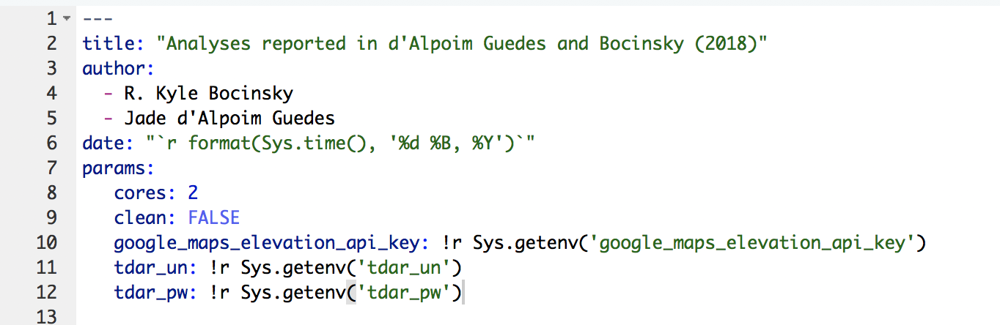
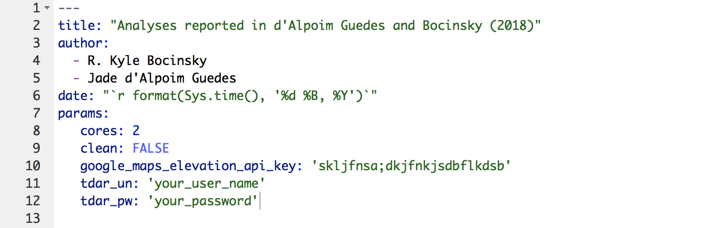

---
output:
  md_document:
    variant: gfm
    pandoc_args: [ 
      "--wrap", "none" 
    ]
---

<!-- README.md is generated from README.Rmd. Please edit that file -->

```{r, echo = FALSE}
knitr::opts_chunk$set(
  collapse = TRUE,
  comment = "#>",
  fig.path = "README-"
)
library(magrittr)
```

[)`-brightgreen.svg)](https://github.com/bocinsky/guedesbocinsky2018/commits/master) 
[](https://circleci.com/gh/bocinsky/guedesbocinsky2018)
[)`-brightgreen.svg)](https://cran.r-project.org/)
[](http://choosealicense.com/licenses/mit/) 
[](https://doi.org/10.5281/zenodo.1239106)

## Research compendium package for d'Alpoim Guedes and Bocinsky (2018)

**When using the code included in this research compendium, please cite *all* of the following:**

> d'Alpoim Guedes, Jade and R. Kyle Bocinsky. Climate change stimulated agricultural innovation and exchange across Asia. In review.

> d'Alpoim Guedes, Jade and R. Kyle Bocinsky. Research compendium for: *Climate change stimulated agricultural innovation and exchange across Asia*, 2018. Version 1.0.0. Zenodo. https://doi.org/10.5281/zenodo.1239106

> d'Alpoim Guedes, Jade and R. Kyle Bocinsky. Data output for: *Climate change stimulated agricultural innovation and exchange across Asia*, 2018. Version 1.0.0. Zenodo. http://doi.org/10.5281/zenodo.788601

### Compendium DOI: 
 
[](https://doi.org/10.5281/zenodo.1239106)

The files at the URL above will generate the results as found in the publication. The files hosted at [https://github.com/bocinsky/guedesbocinsky2018](https://github.com/bocinsky/guedesbocinsky2018) are the development versions and may have changed since this compendium was released.

### Authors  of this repository:

- R. Kyle Bocinsky ([bocinsky@gmail.com](mailto:bocinsky@gmail.com))
- Jade d'Alpoim Guedes ([jadeguedes@gmail.com](mailto:jadeguedes@gmail.com))

### Overview of contents
This repository is a research compendium package for d'Alpoim Guedes and Bocinsky (2018). The compendium contains all code associated with the analyses described and presented in the publication, as well as a Docker environment (described in the `Dockerfile`) for running the code.

This compendium is an R package, meaning that by installing it you are also installing most required dependencies. See below for hints on installing some of the command-line tools necessary in this analysis on macOS and Linux. This compendium takes a lot of its cues from [Ben Marwick's `rrtools` package](https://github.com/benmarwick/rrtools) for performing reproducible research.

The analyses presented in Guedes and Bocinsky (2018) are performed in an RMarkdown vignette (`guedesbocinsky2018.Rmd`) located in the `vignettes` directory.

### Downloading the compendium package
This compendium package may be downloaded as Data file S3 from d'Alpoim Guedes and Bocinsky (2018), directly from Github as an archive, or cloned with `git`.

#### Downloading directly from Github
You can download the compendium package using the following link:

[https://github.com/bocinsky/guedesbocinsky2018/archive/1.0.0.zip](https://github.com/bocinsky/guedesbocinsky2018/archive/1.0.0.zip)

#### Cloning via `git`
To download this research compendium as you see it on GitHub, for offline browsing, [install git on your computer](https://git-scm.com/) and use this line at a Bash prompt ("Terminal" on macOS and Unix-alikes, "Command Prompt" on Windows):

```bash
# Clone into the repository
git clone https://github.com/bocinsky/guedesbocinsky2018.git

# Change directories into the local repository
cd guedesbocinsky2018

# Checkout the publication tag
git checkout tags/1.0.0
```

### System requirements
Among the system dependencies for this package are [GDAL](http://www.gdal.org/), [FFMPEG](https://www.ffmpeg.org/), and [Ghostscript](https://www.ghostscript.com/). These packages (and their respective dependencies) must be installed in order to run the analyses. Additionally, Cairo must be among the capabilities of your particular R installation (as it probably is if you installed from a pre-compiled binary download available on CRAN).

#### macOS
We strongly suggest using [Homebrew](https://brew.sh/) to install the system dependencies. Homebrew commands might be:

```bash
brew install gdal --with-complete --with-unsupported
brew install ffmpeg
brew install ghostscript
```

#### Linux
Please refer to the dockerfiles for [rocker/geospatial](https://github.com/rocker-org/geospatial/blob/master/Dockerfile) and [bocinsky/bocin_base](https://github.com/bocinsky/bocin_base/blob/master/Dockerfile).

#### Windows
This software has not been tested on Windows, but should install and work fine if all system requirements are installed.


### Authentication for the Google Elevation API and tDAR
This analyses requires the user to have the Google Elevation API key and a tDAR user name and password either as environment variables or passed to the `guedesbocinsky2018.Rmd` RMarkdown vignette as parameters. Please see the [Running the analysis] sections below for guidance on setting these parameters.

#### Archaeological site data from tDAR
Archaeological site location data are sensitive information due to the possibility of looting, and archaeological ethics require that we restrict access to those data. Accordingly, an essential component of this analysis is **not** shipped in this open GitHub repository or archived with Zenodo. We have instead archived the site location data necessary to run this analysis with the [Digital Archaeological Record (tDAR)](https://www.tdar.org/) under restricted access. Users who want to run this analysis need to request access through tDAR, which we will provide to any researcher with a reasonable affiliation (academic or otherwise). The main purpose is to track to whom we provide access.

The data are available through tDAR at the following DOI: [10.6067/XCV8MK6G05](https://doi.org/10.6067/XCV8MK6G05). Please go to the site and select "Request Access, Submit Correction, Comment" under the downloads section in the right panel. You will have to [create a tDAR user account](https://core.tdar.org/account/new) and agree to the [tDAR user agreement](https://www.tdar.org/about/policies/terms-of-use/).

This analysis uses the tDAR application programming interface (API) to authenticate a user into tDAR and access and download the archaeological site data.

### Running the analysis
There are three ways to run the analysis:

- **[Running from within *R*]** --- Do this if your goal is to explore how we developed the model, or to change parameters.
- **[Running from the terminal]** --- Do this if your goal is just to reproduce the output on your local machine/environment.
- **[Running from a Docker container]** --- Do this if your goal is to reproduce our results precisely, using a custom-build and pre-tested environment.

#### A note on run time
This analysis has been designed to take advantage of modern multi-core or multi-CPU computer architectures. By default, it will run on two cores—i.e., sections of the code will run in parallel approximately twice as fast as on a single core. The analysis also consumes quite a bit of memory. On two (relatively high-speed) cores, run-time of the entire analysis is **approximately 12 hours**. This can be sortened dramatically by running with a higher number of cores/processors and amount of memory, if available.

#### Running from within *R*
**This is what most users will want want to run if your goal is to explore how we developed the model, or to change parameters.** Be sure that you have a working version of *R* installed (>= 3.4.4) and the [RStudio development environment](https://www.rstudio.com/products/rstudio/download/).

1. Download the compendium package
2. Un-zip the archive and navigate into the `guedesbocinsky2018-1.0.0` directory. 
3. Launch the guedesbocinsky2018.Rproj file (should open up RStudio).
4. Install the package with:
  ```r
  ## Install the devtools package, if not previously installed
  # install.packages("devtools")
  ## Install the development version of devtools
  library(devtools)
  install_github("r-lib/devtools")
  library(devtools)
  install(dependencies = TRUE)
  ```
5. Go to the `vignettes/` directory.
6. Open `guedesbocinsky2018.Rmd`.
7. Set environment variables (in header at the top of the document). You should replace the sections that start with `!r` (through the end of the line) with your Google Maps Elevation API key, tDAR user name, and tDAR password (each in single quotes). It should look something like this before replacement:
  
  After replacement:
  
8. Press "**Knit**" at the top of the screen to run the analysis.

#### Running from the terminal
**This is what you want to run to reproduce our results from the terminal. We strongly encourage you to run the analysis from _R_ and RStudio if your goal is to explore how we developed the model, or to change parameters.**

To run this analysis from the terminal, first you must ensure you have downloaded the compendium package and installed all system requirements. We've included a convenient script for running the entire analysis, including installing the compendium package.

First, set your environment variables in the terminal. On Unix-alike systems (including Linux and macOS), you can set environmental variables in the terminal like so:

```bash
export google_maps_elevation_api_key=YOUR_API_KEY
export tdar_un=YOUR_TDAR_USER_NAME
export tdar_pw=YOUR_TDAR_PASSWORD
```

Then, from within the `guedesbocinsky2018` directory in the terminal:

```bash
bash inst/guedesbocinsky2018_BASH.sh
```

Output will appear in the `vignettes/` directory.

#### Running from a Docker container
**This is what you want to run to reproduce our results precisely. We strongly encourage you to run the analysis from _R_ and RStudio if your goal is to explore how we developed the model, or to change parameters.**

[Docker](https://www.docker.com/) is a virtual computing environment that facilitates reproducible research---it allows for research results to be produced independent of the machine on which they are computed. Docker users describe computing environments in a text format called a "Dockerfile", which when read by the Docker software builds a virtual machine, or "container". Other users can then load the container on their own computers. Users can upload container images to [Docker Hub](https://hub.docker.com/), and the image for this research (without the analyses run) is available at [https://hub.docker.com/r/bocinsky/guedesbocinsky2018/](https://hub.docker.com/r/bocinsky/guedesbocinsky2018/).

We have included a Dockerfile which builds a Docker container for running the analyses described in the paper. It uses [`rocker/geospatial:3.4.4`](https://hub.docker.com/r/rocker/geospatial/), which provides R, [RStudio Server](https://www.rstudio.com/products/rstudio/download-server/), the [tidyverse](http://tidyverse.org/) of R packages as its base image and adds several geospatial software packages ([GDAL](http://www.gdal.org/), [GEOS](https://trac.osgeo.org/geos/), and [proj.4](http://proj4.org/). The Dockerimage (1) adds ffmpeg, (2) updates the R packages, and (3) installs the R software packages required by this package.

##### Downloading and running the Docker container image
The commands below demonstrate three ways to run the docker container. See this [Docker cheat sheet](https://github.com/wsargent/docker-cheat-sheet) for other arguments. Using the ":1.0.0" tag will ensure you are running the version of the code that generates the d'Alpoim Guedes and Bocinsky (2018) results---the first time you run the Docker image, it will download it from the Docker Hub.

##### Setting your environment variables
Set your environment variables in the terminal. On Unix-alike systems (including Linux and macOS), you can set environmental variables in the terminal like so:

```bash
export google_maps_elevation_api_key=YOUR_API_KEY
export tdar_un=YOUR_TDAR_USER_NAME
export tdar_pw=YOUR_TDAR_PASSWORD
```

##### Run the analysis directly
To run the analyses directly, render the `guedesbocinsky2018.Rmd` RMarkdown vignette at the end of the run command like so (in the terminal):

```bash
docker run bocinsky/guedesbocinsky2018:1.0.0 r -e "rmarkdown::render('/guedesbocinsky2018/vignettes/guedesbocinsky2018.Rmd', \
                                                                              params = list(cores = 1, \
                                                                              clean = FALSE, \
                                                                              google_maps_elevation_api_key = '$google_maps_elevation_api_key', \
                                                                              tdar_un = '$tdar_un',\
                                                                              tdar_pw = '$tdar_pw'))"
```

##### Run the analysis interactively from the terminal
Alternatively, you can run the container in interactive mode and load the script yourself like so (in the terminal):

```bash
docker run -it bocinsky/guedesbocinsky2018:1.0.0 bash
```

You can use the `exit` command to stop the container.

##### Run the analysis from within a Dockerized RStudio IDE
Finally, you can host RStudio Server locally to use the RStudio browser-based IDE. Run like so (in the terminal):

```bash
docker run -p 8787:8787 bocinsky/guedesbocinsky2018:1.0.0
```

Then, open a browser (we find [Chrome](https://www.google.com/chrome/) works best) and navigate to "localhost:8787" or or run `docker-machine ip default` in the shell to find the correct IP address, and log in with **rstudio**/**rstudio** as the user name and password. In the explorer (lower right pane in RStudio), navigate to the `guedesbocinsky2018` directory, and click the `guedesbocinsky2018.Rproj` to open the project.

##### Building the Docker container from scratch
If you wish to build the Docker container locally for this project from scratch, simply `cd` into this `guedesbocinsky2018/` directory and run like so (in the terminal):

```bash
docker build -t bocinsky/guedesbocinsky2018 .
```
The `-t` argument gives the resulting container image a name. You can then run the container as described above, except without the tag.

##### Run in Docker using the convenience script
We have also included a bash script that builds the Docker container, executes the analysis, and moves the results onto your local machine. To use it, open the terminal, make sure you are in the `guedesbocinsky2018/` directory, then run the following:

First, set your environment variables in the terminal. On Unix-alike systems (including Linux and macOS), you can set environmental variables in the terminal like so:

```bash
export google_maps_elevation_api_key=YOUR_API_KEY
export tdar_un=YOUR_TDAR_USER_NAME
export tdar_pw=YOUR_TDAR_PASSWORD
```

Then, change into the `guedesbocinsky2018/` directory, and run the convenience script:

```bash
bash inst/guedesbocinsky2018_DOCKER.sh
```

The entire analysis will appear in a `docker_out/` directory when the analysis finishes.

### Output
The GitHub repository for this project does not contain the output generated by the script---`r "vignettes/zenodo" %>% list.files(all.files = TRUE, recursive = TRUE, full.names = TRUE) %>% file.size() %>% sum() %>% magrittr::divide_by(1000000000) %>% round(digits = 2)` GB of compressed data. All output data is available as a separate Zenodo archive at:

[](https://doi.org/10.5281/zenodo.788601)

The `vignettes/` directory contains all data generated by the `guedesbocinsky2018.Rmd` RMarkdown vignette:

- `data/raw_data` contains data downloaded from web sources for this analysis
- `data/derived_data/` contains tables of the raw site chronometric data without locational information, and the modeled chronometric probability and niche information for each site.
- `data/derived_data/models/` contains R data objects describing the Kriging interpolation models across the study area
- `data/derived_data/recons/` contains NetCDF format raster bricks of the model output (i.e., the reconstructed crop niches)
- `figures/` contains all figures output by the script, including videos of how each crop niche changes over time
- `figures/site_densities/` contains figures of the estimated chronometric probability density for each site in our database
- `submission/` contains all of the figures, tables, movies, and supplemental datasets included with d'Alpoim Guedes and Bocinsky (2018)

### Licenses

Code: [MIT](http://opensource.org/licenses/MIT) year: `r format(Sys.Date(), "%Y")`<br>
Copyright holders: R. Kyle Bocinsky and Jade d'Alpoim Guedes

### Contact

**R. Kyle Bocinsky, PhD, RPA**<br>
[Montana Climate Office](https://climate.umt.edu/), University of Montana<br>
[Division of Earth and Ecosystem Sciences](https://www.dri.edu/earth-ecosystem-sciences), Desert Research Institute<br>
The [Research Institute](http://www.crowcanyon.org/institute/) at Crow Canyon Archaeological Center<br>
770.362.6659 – Mobile<br>
[bocinsky@gmail.com](mailto:bocinsky@gmail.com) – Email<br>
[bocinsky.io](http://www.bocinsky.io/) – Web
